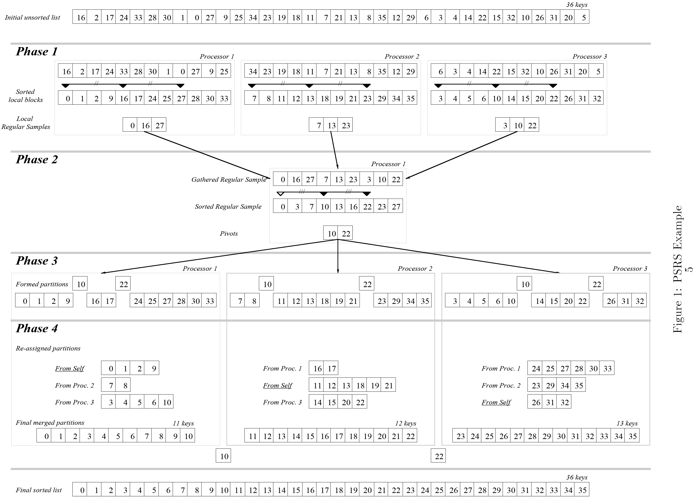

# Parallel Sorting by Regular Sampling (PSRS)

This repository contains my implementation of the [PSRS](http://www.math-cs.gordon.edu/courses/cps343/doc/psrs.pdf) sorting algorithm.

Here's the overview of the algorithm from the paper.

This repository has 2 different implementation of the same algorithm:
- multi-threaded version with `pthreads`
- distributed version with `MPI`